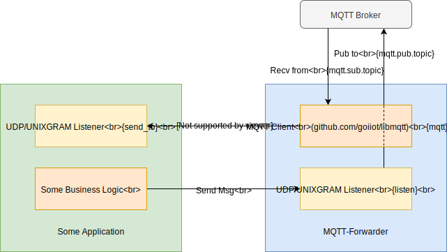

# MQTT Forwarder

A simple `MQTT <-> UDP/UNIXGRAM` bridge.

## Workflow

- Rx (recv from `MQTT`)
  - Subscribe one `MQTT` topic.
  - Wait and receive messages sent from the subscribed `MQTT` topic.
  - Send received topic messages to the target addr (via `UDP/UNIXGRAM`).
- Tx (publish to `MQTT`)
  - Listen one `UDP`/`UNIXGRAM` address.
  - Wait and receive messages sent to the listening address.
  - Publish received messages to the designated `MQTT` topic.



## Build

### Prerequisites

- go 1.11+

## Instructions

This project requires nothing extra to build, all required dependency has been vendored.

```bash
go build -o build/mqtt-forwarder -ldflags='-s -w' -mod=vendor ./cmd

# if you already have `make` installed, just
# $ make mqtt-forwarder
```

__NOTE:__ you can use `upx` to further shrink the size of it.

## Deployment

1. [Build](#build) as stated in previous section.
2. Copy the built binary to your target device.
3. Create a configuration for your target device (see [sample.config.yaml](./sample.config.yaml) for example).
4. Start the `mqtt-forwarder` with configuration `/path/to/mqtt-forwarder -c /path/to/mqtt-forwarder.config.yaml`

Done, check your MQTT Broker and do some test to make sure everything working.

## LICENSE

[](https://github.com/goiiot/mqtt-forwarder/blob/master/LICENSE.txt)

```text
Copyright Go-IIoT (https://github.com/goiiot)

Licensed under the Apache License, Version 2.0 (the "License");
you may not use this file except in compliance with the License.
You may obtain a copy of the License at

    http://www.apache.org/licenses/LICENSE-2.0

Unless required by applicable law or agreed to in writing, software
distributed under the License is distributed on an "AS IS" BASIS,
WITHOUT WARRANTIES OR CONDITIONS OF ANY KIND, either express or implied.
See the License for the specific language governing permissions and
limitations under the License.
```